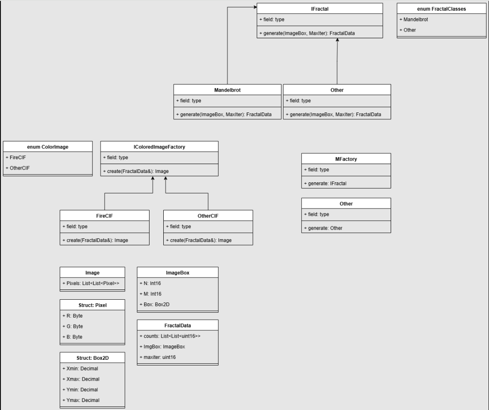
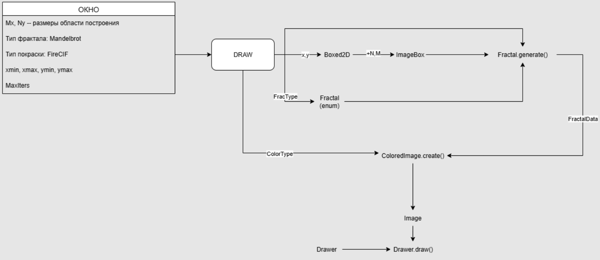

# Спецификации по проекту

Текущая UML-диаграмма структуры классов проекта, предложенная группой после совместного обсуждения на сегодняшнем занятии:

Ссылка на (обновляемый) вариант UML-диаграммы:

https://viewer.diagrams.net/index.html?tags=%7B%7D&lightbox=1&highlight=0000ff&edit=_blank&layers=1&nav=1&title=uml%20Fractal.drawio&dark=auto#Uhttps%3A%2F%2Fdrive.google.com%2Fuc%3Fid%3D1MvJ2yz6N_vM3CwArZoMFCQVBcrf6b51g%26export%3Ddownload#%7B%22pageId%22%3A%22AUz20VrSMRsr3q2WFpRm%22%7D

